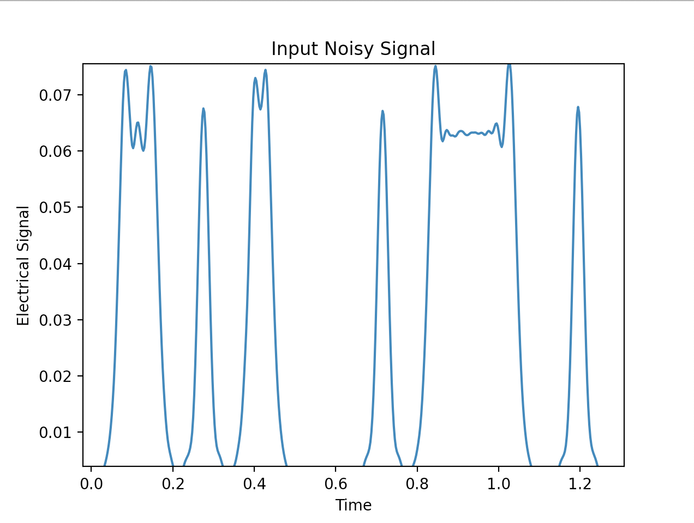
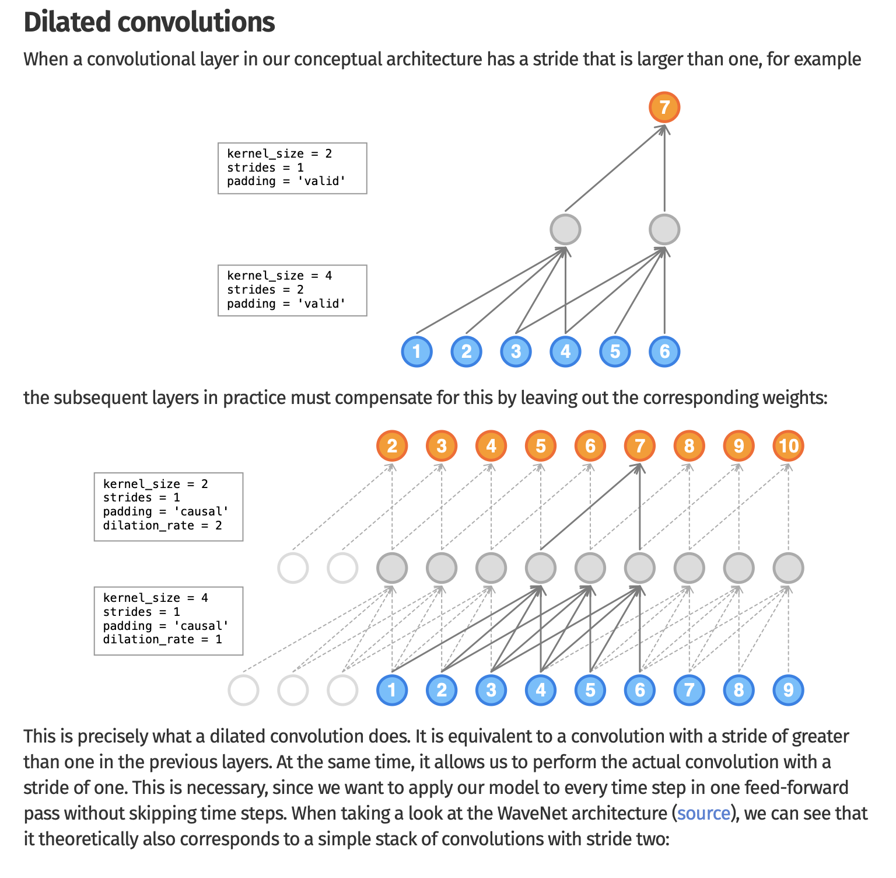
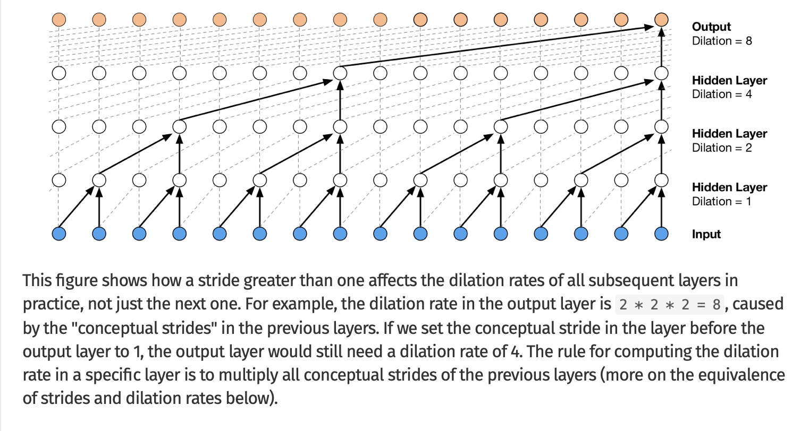
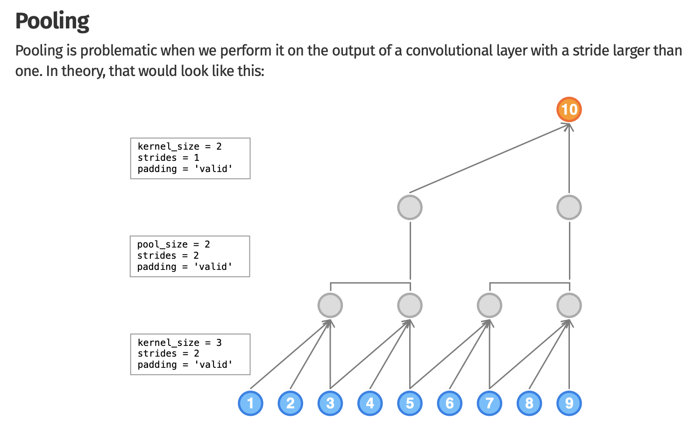
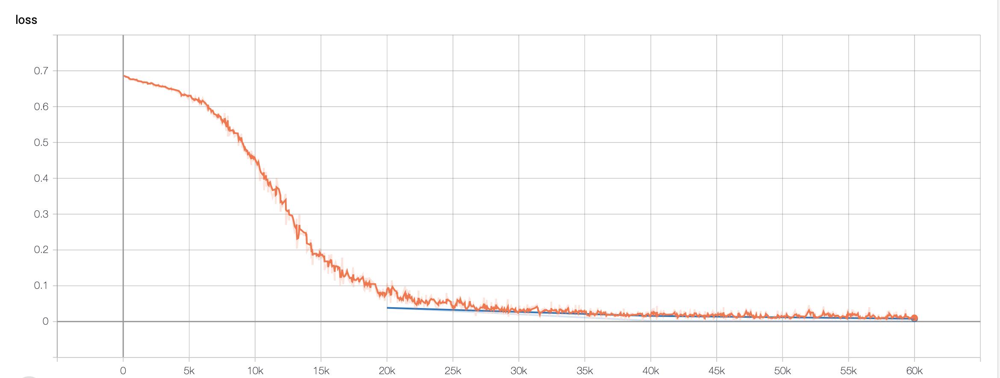
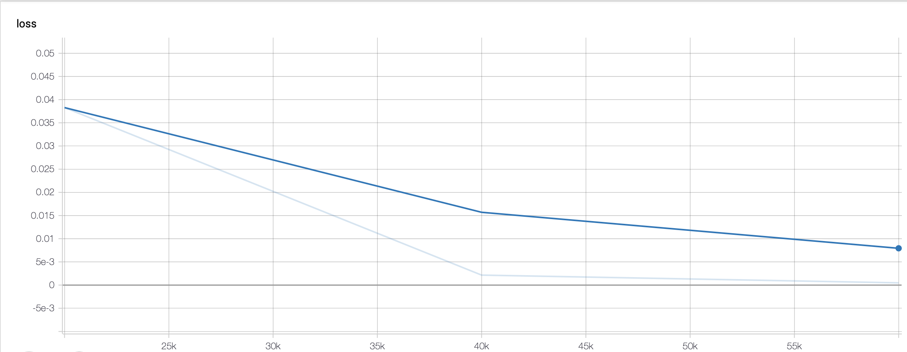

# Decoding-Distorted-Signals-in-Optical-Fibers

Using TensorFlow to decode signals sent through simulated optical fiber channels. This Project is a joint effort by Kartik Dutt and Lakshya Ojha of Electronics and Communications of DTU'21.
This project is part of the term project for Optical Communication.

## Understanding the Data and the Objective

Let's consider a simple baseband signal as shown below. This is the data that we use for training the model. We use this input signal and convert it to an encoded form such as Binary NRZ or 4-PAM. We also add to noise to these signals to simulate optical behavior. The model is then trained to reproduce the orignal signal with the noisy encoded signal as input.



## Simulating the Optical Channel and encoding the signal.

For getting the required signal, we will the use the code available in `generate_labels.m`. As the name suggests, It will take a user input i.e. one of NRZ or PAM4 and will convert the input files (data mentioned above) into desired labels. Read the content below to understand NRZ and PAM encoding.

### Binary NRZ

Non-Return-to-Zero (NRZ) line code is a binary code in which ones are represented by one significant condition, usually a positive voltage, while zeros are represented by some other significant condition, usually a negative voltage, with no other neutral or rest condition. The pulses in NRZ have more energy than a return-to-zero (RZ) code, which also has an additional rest state beside the conditions for ones and zeros. NRZ is not inherently a self-clocking signal, so some additional synchronization technique must be used for avoiding bit slips; examples of such techniques are a run-length-limited constraint and a parallel synchronization signal.

### Pulse Amplitude Modulation

Pulse-amplitude modulation (PAM), is a form of signal modulation where the message information is encoded in the amplitude of a series of signal pulses. It is an analog pulse modulation scheme in which the amplitudes of a train of carrier pulses are varied according to the sample value of the message signal. Demodulation is performed by detecting the amplitude level of the carrier at every single period. 
The number of possible pulse amplitudes in analog PAM is theoretically infinite. Digital PAM reduces the number of pulse amplitudes to some power of two. For example, in 4-level PAM there are  2^{2} possible discrete pulse amplitudes; in 8-level PAM there are 2^{3} possible discrete pulse amplitudes; and in 16-level PAM there are 2^{4} possible discrete pulse amplitudes.

## The First Model : Dilated CNN for decoding the model.

We use 1D dilated causal convolutions. The following text below goes into details about convolution and pooling layers. More details can be found on them on either `nn.docs` or `tf.docs`.

The `dilated_neural_network.py` file consists the model required for decoding the noisy signal.





## Training the model

We use the `train_model.py` file to train the model. To read how the model is trained and weights are updated, I highly suggest looking into Andrej Karpathy's talk about backpropogation. However the presenter of this project will go into the details as required.

Run the following commands
```
# Train the model.
python3 train_model.py (Input = {NRZ / PAM})
# Visualize the results.
tensorboard --logdir=/tmp/dilated_cnn_model_binary # Or whatever directory you use.
```
## Results :

We are able to recover the message signal with less than 2% loss of information. The below graph shows the training logs of the model.

#### Training Results



#### Validation Results



